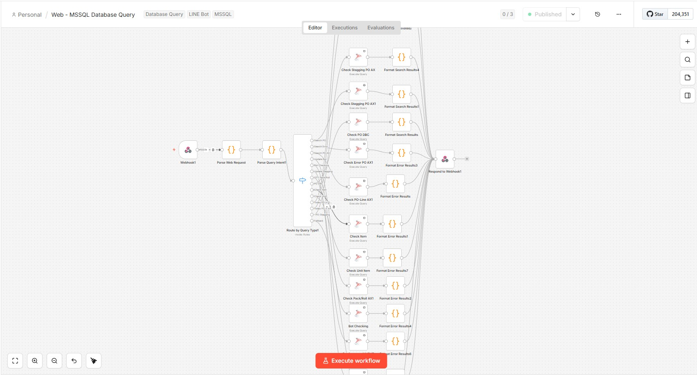

# Web-To-Query

**One page, thirteen query modes, three databases — and the browser never holds a credential or builds a line of SQL.**

<p>
  
  
  
  
  
  
  
</p>

Used at **Hi-Tech Apparel** to answer purchase-order questions that otherwise need a DBA: is this PO
in staging, did it reach AX, why did it error, do the quantities and prices match across systems.
Every mode posts a JSON body to **one n8n webhook**, which runs the matching SQL and returns rows the
page renders.

```
browser  →  { queryType, searchKeyword }  →  one n8n webhook  →  MSSQL (Staging · AX · DBC)  →  table
```

Both ends of that arrow are pictured here: the page below, and
**[the n8n workflow that answers it](#the-other-half-the-n8n-workflow)**.


<sub>**BotPO Checking** on real data — execution IDs, PO numbers, item IDs, colour codes, seasons and
the query history are blurred, and so is the SQL body, because it carries internal D365 schema. What
it shows: the query modes down the left with a live row count each, the read-only **SQL preview** of
the query n8n will run, the PO and Item ID filters, and Export Excel. <em>(Screenshot predates
**Search PO (Staging)**, so twelve modes are visible rather than thirteen.)</em></sub>

---

## The problem it solves

The answers live in three different databases, and nobody outside IT can reach them. The old routine
was to ask someone to run a query, wait, and get a screenshot back — repeated for every PO, and
again for every follow-up question.

The design choice that makes this safe to hand to merchandisers: **the browser is not a database
client.** It sends a mode name and a keyword; n8n owns the connection strings, the SQL and the
credentials. So the page can sit on any PC, and the worst it can do is ask a question the webhook
already allows.

- **No SQL in the frontend**, so nobody can craft a query the webhook did not intend.
- **No credentials in the repo** — settings live in `localStorage`, per browser, so there is no
  `.env` and nothing to leak.
- **Comparisons run in parallel.** The two compare modes fire both queries at once and render when
  both resolve, instead of making the user run two modes and diff by eye.

---

## The thirteen modes

| Group | Modes |
|---|---|
| **Look up a PO** | Search BotPO (Staging) · Search PO (Staging) · Search PO DBC · PO Line (AX) · Error PO |
| **Check master data on AX** | Check Item On AX · Check Unit On AX |
| **Pack / roll** | Pack / Roll · QTY Pack/Roll |
| **Compare across systems** | Compare Stg vs PO AX · Compare Stg vs PO DBC — *two queries in parallel, rendered side by side with ✓ Match / Δ badges* |
| **Bot PO** | BotPO Checking · Update Staging Status |

Each mode maps to a `queryType` that n8n switches on; adding one is a table entry plus a nav item,
not a new page.

The two staging lookups are the clearest illustration. **Search BotPO (Staging)** and **Search PO
(Staging)** read the same columns from the same table and draw the same fourteen-column result — what
makes them different questions is the `queryType` they post, which is the only thing the webhook
sees. Give two modes the same one and n8n cannot tell them apart; both land in whichever branch
matches first.

A mode's key and its wire value need not match. `QUERY_TYPES` in
[`js/core.js`](Final%20Version/js/core.js) maps the ones that differ — mode `find` posts `Find` —
so internal keys stay lowercase like every other mode while the payload keeps the exact spelling the
n8n Switch expects.

**Compare falls back from one staging lookup to the other.** Compare Stg vs PO AX asks Search BotPO
first, whose SQL only sees executions named `BotPO…`. A PO that reached staging through some other
execution matches nothing there — so the compare re-asks with Search PO and compares *that* against
AX rather than showing a blank staging side. The results header names whichever query supplied the
staging rows, so the fallback is never silent.

---

## The other half: the n8n workflow

Everything above happens in a browser that cannot reach a database. This is what receives it.



<sub>**Web - MSSQL Database Query** — the whole backend on one canvas. A single **Webhook** takes the
`POST`, two Code nodes parse it, and **Route by Query Type** fans out to one branch per mode. Each
branch is an **Execute Query** node paired with a Code node that reshapes the rows, and every branch
converges on one **Respond to Webhook**.</sub>

Reading it left to right explains the whole contract:

- **One entry point.** Every mode posts to the same URL. There is no per-mode endpoint to configure,
  which is why the app needs exactly one setting.
- **The Switch is the routing table.** `queryType` picks the branch — so the value a tab posts *is*
  the question it asks, and two tabs posting the same value are the same question. The Switch ends in
  a **Fallback** output, so an unrecognised value doesn't error, it just returns nothing useful.
- **The SQL lives here, not in the page.** Each `Execute Query` node holds its own statement against
  Staging, AX or DBC. The browser only ever names a mode.
- **Adding a mode is adding a branch.** A new Switch output, an Execute Query, a Format node — the
  frontend side is a table entry and a nav item.

> ⚠️ The two sides are edited independently and nothing links them. A mode whose `queryType` has no
> matching Switch output silently takes the Fallback; a Switch branch nobody posts to is dead. When
> you add or rename a mode, change both.

---

## Features

- **Per-column filters** on the wide result sets, with the summary cards recalculating live as you
  filter.
- **Paste a whole list to filter by** — every filter box in the BotPO summary takes values
  comma-separated (spaces, semicolons and newlines work too). PO Summary filters by **PO and by
  item**, so you can ask which POs carry one item; Item Summary filters by item. Each card's count,
  its PO list and its export all narrow together.
- **Excel export** of exactly what the table shows — filters and column choices included, not the
  raw response. The BotPO summary adds two of its own, each exporting only what its card's filters
  currently match: **Item Summary**, one deduplicated row per item, and **PO Summary**, one row per
  item *per season per colour*, with that row's POs and sizes comma-joined into a cell each — so a
  row splits only where a value genuinely differs. Both carry the colour code and its name.
- **Query history**, kept client-side, so re-running yesterday's check is one click.
- **Three themes** — dark, light and `space` — set on `data-theme` and remembered.
- **Full-error popup** for rows whose error text is far too long for a cell.
- **4-decimal quantities** wherever a fractional qty is real, so `0.2438` is never displayed as `0`.

---

## Using it

**The app in use** — no install, no build:

```
open "Final Version/index.html"
```

Then click the **gear icon** and paste your n8n webhook URL. Nothing works until that is set.

**The React port** — needs Node:

```bash
cd po-query-react
npm install && npm run dev
```

> ⚠️ **`Final Version` is still the source of truth**, but the React port is now at feature parity:
> all thirteen modes, the same filters and Excel exports, and the four report windows — which it
> shares with the vanilla app by porting `js/reports.js` wholesale into `src/reports/`. Change a
> report in one and copy it to the other; nothing keeps them in sync automatically.
>
> ⚠️ **Settings are per browser.** The webhook URL and auth token live in `localStorage`, so clearing
> site data loses them — and `po_auth` is a token readable by any script on the page. Fine for an
> internal tool on a trusted machine; not something to point at a webhook that reaches anything
> sensitive.

---

## Under the hood

| | |
|---|---|
| **The app** | [`Final Version/`](Final%20Version) — plain JS, 14 modules loaded as ordinary scripts (no bundler, no imports), 12 stylesheets |
| **Dispatch** | [`js/core.js`](Final%20Version/js/core.js) holds the `MODES` table, the `QUERY_TYPES` overrides and `isStagingSearch()` · [`js/query.js`](Final%20Version/js/query.js) runs each mode, including the two parallel compares |
| **Transport** | [`js/utils.js`](Final%20Version/js/utils.js) — `fetchQuery()` builds the request body, throws on non-2xx, and strips n8n's empty filler row so "no data" doesn't count as one row |
| **Renderers** | one per shape: results, DBC header+lines, Staging vs AX, Staging vs DBC — modes that share a shape share a renderer, so `find` reuses everything `search` draws, down to the `#search-tbody` its filters target |
| **React port** | [`po-query-react/`](po-query-react) — React 19 + Vite 8, one component per mode in `src/tabs/`, the shared report windows in `src/reports/` |

---

## Documentation

**[docs/DEVELOPER-GUIDE.md](docs/DEVELOPER-GUIDE.md)** — the full guide: the file layout module by
module, every mode with the exact `queryType` each sends and why a mode key is not always its
`queryType`, the request body and which modes add extra fields, the one non-flat response shape, the
summary windows and their filters, the `localStorage` keys, and the places to touch when adding a
mode.

---

<sub>Internal tool for HI-TECH APPAREL · there is no `.env` and no credentials in this repo by
design — the webhook URL and auth token are typed into the ⚙ dialog and stay in the browser.</sub>
