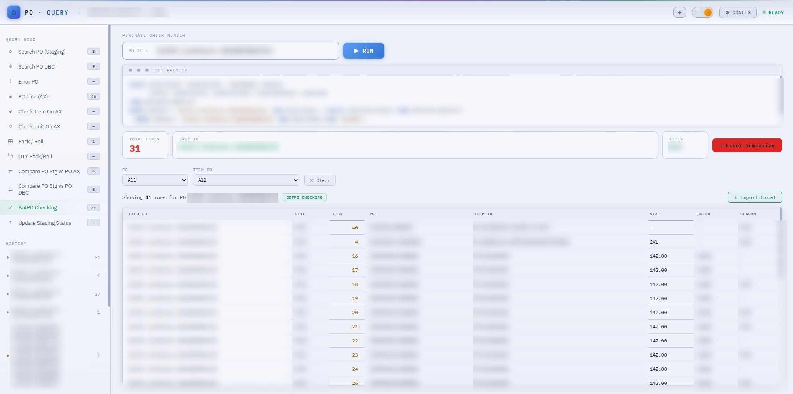

# Web-To-Query

**One page, twelve query modes, three databases — and the browser never holds a credential or builds a line of SQL.**

<p>
  
  
  
  
  
  
  
</p>

Used at **Hi-Tech Apparel** to answer purchase-order questions that otherwise need a DBA: is this PO
in staging, did it reach AX, why did it error, do the quantities and prices match across systems.
Every mode posts a JSON body to **one n8n webhook**, which runs the matching SQL and returns rows the
page renders.

```
browser  →  { queryType, searchKeyword }  →  one n8n webhook  →  MSSQL (Staging · AX · DBC)  →  table
```



<sub>**BotPO Checking** on real data — execution IDs, PO numbers, item IDs, colour codes, seasons and
the query history are blurred, and so is the SQL body, because it carries internal D365 schema. What
it shows: the twelve modes down the left with a live row count each, the read-only **SQL preview** of
the query n8n will run, the PO and Item ID filters, and Export Excel.</sub>

---

## The problem it solves

The answers live in three different databases, and nobody outside IT can reach them. The old routine
was to ask someone to run a query, wait, and get a screenshot back — repeated for every PO, and
again for every follow-up question.

The design choice that makes this safe to hand to merchandisers: **the browser is not a database
client.** It sends a mode name and a keyword; n8n owns the connection strings, the SQL and the
credentials. So the page can sit on any PC, and the worst it can do is ask a question the webhook
already allows.

- **No SQL in the frontend**, so nobody can craft a query the webhook did not intend.
- **No credentials in the repo** — settings live in `localStorage`, per browser, so there is no
  `.env` and nothing to leak.
- **Comparisons run in parallel.** The two compare modes fire both queries at once and render when
  both resolve, instead of making the user run two modes and diff by eye.

---

## The twelve modes

| Group | Modes |
|---|---|
| **Look up a PO** | Search PO (Staging) · Search PO DBC · PO Line (AX) · Error PO |
| **Check master data on AX** | Check Item On AX · Check Unit On AX |
| **Pack / roll** | Pack / Roll · QTY Pack/Roll |
| **Compare across systems** | Compare Stg vs PO AX · Compare Stg vs PO DBC — *two queries in parallel, rendered side by side with ✓ Match / Δ badges* |
| **Bot PO** | BotPO Checking · Update Staging Status |

Each mode maps to a `queryType` that n8n switches on; adding one is a table entry plus a nav item,
not a new page.

---

## Features

- **Per-column filters** on the wide result sets, with the summary cards recalculating live as you
  filter.
- **Excel export** of exactly what the table shows — filters and column choices included, not the
  raw response. The BotPO **Item Summary** exports one deduplicated row per item.
- **Query history**, kept client-side, so re-running yesterday's check is one click.
- **Three themes** — dark, light and `space` — set on `data-theme` and remembered.
- **Full-error popup** for rows whose error text is far too long for a cell.
- **4-decimal quantities** wherever a fractional qty is real, so `0.2438` is never displayed as `0`.

---

## Using it

**The app in use** — no install, no build:

```
open "Final Version/index.html"
```

Then click the **gear icon** and paste your n8n webhook URL. Nothing works until that is set.

**The React port** — needs Node:

```bash
cd po-query-react
npm install && npm run dev
```

> ⚠️ **`Final Version` is the source of truth.** The React port lags by one mode — `Check Unit On AX`
> was added to the vanilla app afterwards and never ported.
>
> ⚠️ **Settings are per browser.** The webhook URL and auth token live in `localStorage`, so clearing
> site data loses them — and `po_auth` is a token readable by any script on the page. Fine for an
> internal tool on a trusted machine; not something to point at a webhook that reaches anything
> sensitive.

---

## Under the hood

| | |
|---|---|
| **The app** | [`Final Version/`](Final%20Version) — plain JS, 14 modules loaded as ordinary scripts (no bundler, no imports), 12 stylesheets |
| **Dispatch** | [`js/core.js`](Final%20Version/js/core.js) holds the `MODES` table · [`js/query.js`](Final%20Version/js/query.js) runs each mode, including the two parallel compares |
| **Transport** | [`js/utils.js`](Final%20Version/js/utils.js) — `fetchQuery()` builds the request body and throws on non-2xx |
| **Renderers** | one per shape: results, DBC header+lines, Staging vs AX, Staging vs DBC |
| **React port** | [`po-query-react/`](po-query-react) — React 19 + Vite 8 |

---

## Documentation

**[docs/DEVELOPER-GUIDE.md](docs/DEVELOPER-GUIDE.md)** — the full guide: the file layout module by
module, all twelve modes with the exact `queryType` each sends, the request body and which modes add
extra fields, the one non-flat response shape, the `localStorage` keys, and the four places to touch
when adding a mode.

---

<sub>Internal tool for HI-TECH APPAREL · there is no `.env` and no credentials in this repo by
design — the webhook URL and auth token are typed into the ⚙ dialog and stay in the browser.</sub>
